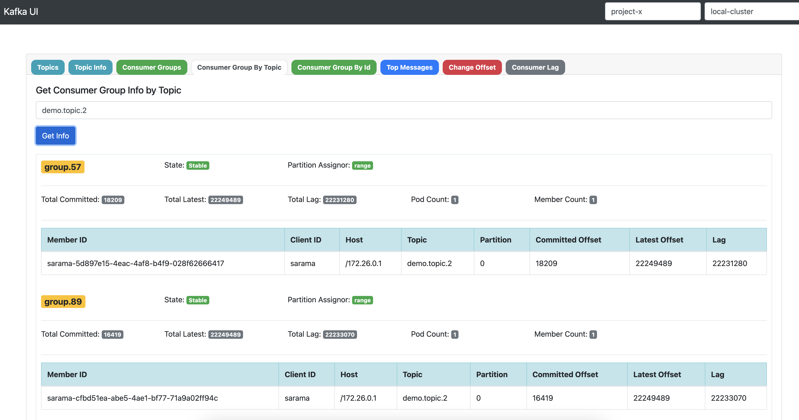

### Kafka UI Application

### Tech Stack ###
- Spring Boot 3.x
- Java 21 (Virtual)
- Spring Kafka Clients

### Features ###
- Multi cluster Support
- Secure Cluster Support
- Consumer Pooling
- Topics, Consumers(by topic/groupId)
- Top Messages
- Change Offset of Group
- Lag Info
- Consumer Info
- Topic Info

## Usage
- Change environment in application.yml
- mvn spring-boot:run
- go localhost:8087 (UI)
- go localhost:8087/swagger-ui.html

## Road Map
- Search data in topic (header/payload)
- Copy topic to another
- Distribute all data of single partition to another partitions

## Screen Shot
